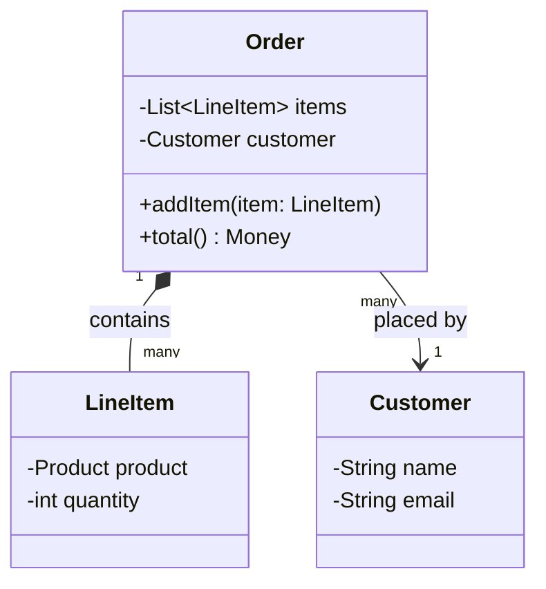
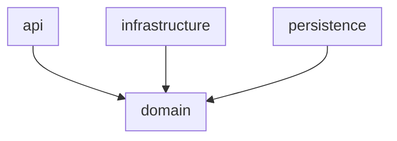
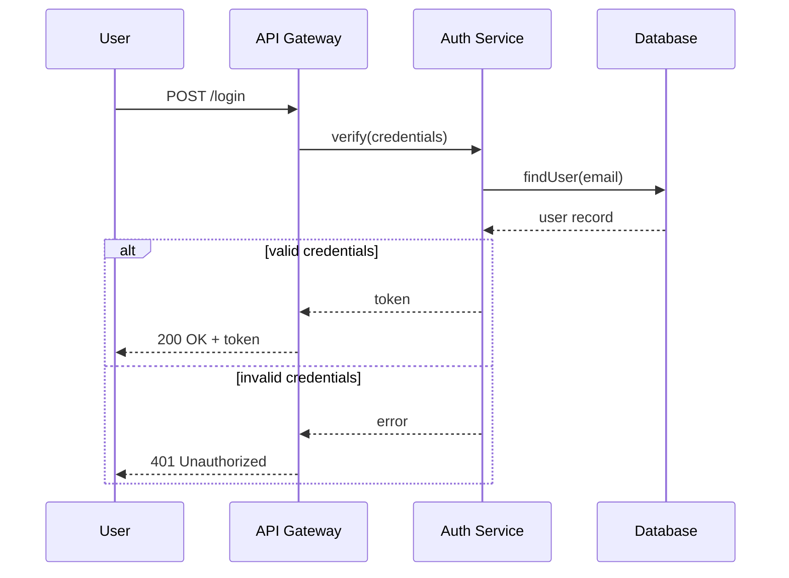
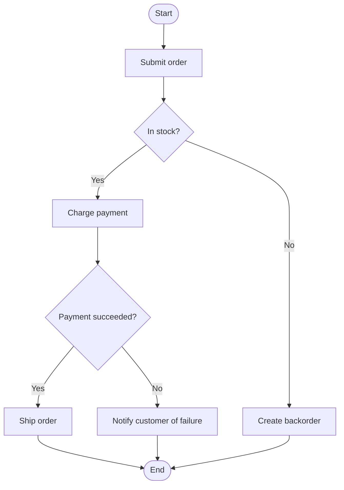

# UML Modeling

A diagram is worth producing when it answers a question faster than prose would, and stays wrong-detectable — a reader can look at it and tell it's out of sync with the code, the way stale prose documentation usually can't be spotted at a glance. Each diagram type below answers a different kind of question; picking the wrong one for the question you actually have produces a diagram that's technically correct and useless.

**Default posture**: don't diagram what a short paragraph or the code itself already communicates clearly. Reach for a diagram when the thing being described is inherently spatial/relational (class structure) or temporal/sequential (call flow) — the two things prose is genuinely worse at conveying than a picture.

## Class Diagram — "what are the things, and how do they relate"

**Question it answers**: what classes/types exist, what fields and methods they expose, and how they relate to each other (inheritance, composition, association).

**Core notation**:
- A class box: name on top, attributes in the middle, methods at the bottom.
- **Inheritance** (is-a): solid line, hollow triangle arrowhead pointing at the parent.
- **Composition** (owns, and the part dies with the whole): solid line, filled diamond at the owner end.
- **Aggregation** (has, but the part can outlive the whole): solid line, hollow diamond at the owner end.
- **Association** (uses/references, no ownership implication): plain solid line.
- **Dependency** (uses temporarily — a method parameter or local variable type): dashed line, open arrowhead.
- Multiplicity (`1`, `0..1`, `*`, `1..*`) labels each end of a relationship line to state how many of each side participate.

**Mermaid**:

**When it earns its cost**: documenting a genuinely non-obvious relationship structure (a domain model with several interacting entities) for onboarding, or working through a design before writing code, where seeing the relationships laid out surfaces a missing multiplicity constraint or an ownership question ("does deleting an Order delete its LineItems?") that's easy to skip past in prose.

**When it doesn't**: a class with two fields and one method doesn't need a diagram — the class declaration itself is the equally-precise, equally-short representation. Diagramming every class in a codebase produces a diagram nobody reads because it has no more signal than browsing the source.

## Package Diagram — "how are the big pieces organized, and what depends on what"

**Question it answers**: at the level of packages/modules/namespaces (not individual classes), what's the dependency structure — which package can see which, and critically, are there dependency cycles.

**Core notation**: package boxes (folder-tab rectangles), dashed arrows for dependency between packages.

**Mermaid** (flowchart with subgraphs approximates this well, since Mermaid has no dedicated package-diagram type):

**What to look for once it's drawn**: cycles. If `domain` depends on `infrastructure` and `infrastructure` depends back on `domain` (directly or through a longer chain), that's a real structural problem — package cycles mean the two "separate" modules can't actually be built, tested, or reasoned about independently, whatever the folder structure suggests. A package diagram's main practical use is making a cycle visible that was invisible scattered across dozens of import statements.

**When it earns its cost**: onboarding to an unfamiliar codebase's high-level structure, or specifically auditing for unwanted coupling between modules that are supposed to be independent (e.g., verifying a "clean architecture" boundary is actually being respected, not just aspirational).

## Sequence Diagram — "what calls what, in what order, across which objects"

**Question it answers**: the exact temporal order of calls between a set of objects/services for one specific scenario — especially useful when the scenario involves several participants and the order of operations, not just which methods exist, is the important part.

**Core notation**:
- Vertical lifelines, one per participant, with a "lifebar" showing when each is active.
- Horizontal solid arrows for synchronous calls, dashed arrows for the corresponding return.
- Horizontal solid arrows with an open head for asynchronous/fire-and-forget calls (no wait for return).
- Alt/opt/loop frames (boxed regions) for conditional or repeated interaction segments.

**Mermaid**:

**When it earns its cost**: documenting or designing a multi-service interaction where the *order* and *branching* of calls is the hard part to communicate — an authentication flow, a distributed transaction, a retry/timeout sequence. This is the one diagram type that's genuinely hard to replace with prose once more than two or three participants and a conditional branch are involved — prose describing "A calls B, which calls C, and if C fails, B retries twice before calling D" gets harder to parse than the equivalent diagram very quickly.

**When it doesn't**: a single method calling another single method needs no diagram — that's just a function call, visible in the code itself.

## Activity Diagram — "what's the flow of an operation or process, including decisions and parallelism"

**Question it answers**: the control flow of a process — sequential steps, decision branches, and parallel/concurrent activities — closer to a flowchart than to a sequence of object interactions. Where a sequence diagram is organized around *which participant does what, in order*, an activity diagram is organized around *the steps of the process itself*, participant-agnostic.

**Core notation**: rounded start/end nodes, rectangles for actions, diamonds for decisions, bars for fork/join (parallel branches).

**Mermaid**:

**When it earns its cost**: documenting a business process or workflow with real branching logic that a stakeholder (who may not read sequence diagrams comfortably) needs to review or approve — activity diagrams read closer to a familiar flowchart, making them the right choice when the audience includes non-engineers. Also useful for designing a state-machine-like process before implementation, to catch missing branches (what happens if stock check fails *and* it's a backorder-ineligible item?) while it's still cheap to add a branch to a diagram, not to already-written code.

**vs. Sequence Diagram**: if the question is "who talks to whom, in what order" (multiple participants, message passing) use a sequence diagram; if the question is "what are the steps of this process, including branches" (a single process's control flow, participant-agnostic) use an activity diagram. A common mistake is using a sequence diagram to describe what's actually just a linear process with no distinct participants — that's an activity diagram's job, more simply.

## Choosing among the four

| Question you're actually asking | Diagram |
|---|---|
| What types exist and how do they relate structurally? | Class |
| What's the dependency structure between modules — any cycles? | Package |
| In what order do these specific objects/services call each other for this scenario? | Sequence |
| What are the steps and decision branches of this process? | Activity |

If none of these questions is the one you're trying to answer, that's a signal a diagram isn't the right tool for what you're documenting right now — reach for prose, or for the `codebase-design` skill's vocabulary (module, seam, interface) if the actual question is about design quality rather than structure visualization.
